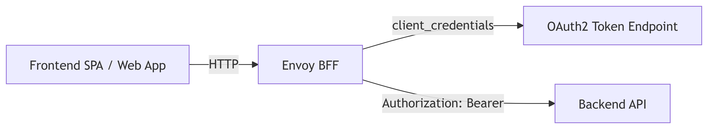

# Application Architecture

## Envoy as Backend For Frontent 
Envoy acts as a backend for frontend (BFF), uses OAuth 2.0 Client Credentials grant to obtain an 
access token from an IdP (e.g. Keycloak), automatically refreshes it, and injects it into every 
upstream API request as an Authorization: Bearer … header.



* Token acquisition handled entirely by Envoy
* Automatic refresh before expiry
* Frontend never sees tokens
* Backend API = Parking API

## Envoy configuration

```
static_resources:
  secrets:
    - name: oauth-client-secret
      generic_secret:
        secret:
          inline_string: "<put-secret-here>"
  listeners:
    - name: http_listener
      address:
        socket_address:
          address: 0.0.0.0
          port_value: 8080
      filter_chains:
        - filters:
            - name: envoy.filters.network.http_connection_manager
              typed_config:
                "@type": type.googleapis.com/envoy.extensions.filters.network.http_connection_manager.v3.HttpConnectionManager
                stat_prefix: ingress_http
                route_config:
                  name: local_route
                  virtual_hosts:
                    - name: backend
                      domains: ["*"]
                      routes:
                        - match:
                            prefix: "/"
                          route:
                            cluster: backend_api
                            host_rewrite_literal: pm.preprod.parking.scheidt-bachmann.net
                http_filters:
                  - name: envoy.filters.http.credential_injector
                    typed_config:
                      "@type": type.googleapis.com/envoy.extensions.filters.http.credential_injector.v3.CredentialInjector
                      overwrite: true
                      credential:
                        name: envoy.http.injected_credentials.oauth2
                        typed_config:
                          "@type": type.googleapis.com/envoy.extensions.http.injected_credentials.oauth2.v3.OAuth2
                          token_endpoint:
                            uri: "https://auth.preprod.parking.scheidt-bachmann.net/auth/realms/de_studentui/protocol/openid-connect/token"
                            cluster: oauth_token
                            timeout: 3s
                          client_credentials:
                            client_id: "B2C_de_studentui"
                            client_secret:
                              name: oauth-client-secret
                          # scopes:
                          #  - api.read                          
                  - name: envoy.filters.http.router               
                    typed_config:
                      "@type": type.googleapis.com/envoy.extensions.filters.http.router.v3.Router


  clusters:
    # Backend API
    - name: backend_api
      connect_timeout: 5s
      type: logical_dns
      lb_policy: round_robin
      load_assignment:
        cluster_name: backend_api
        endpoints:
          - lb_endpoints:
              - endpoint:
                  address:
                    socket_address:
                      address: pm.preprod.parking.scheidt-bachmann.net
                      port_value: 443
      transport_socket:
        name: envoy.transport_sockets.tls
        typed_config:
          "@type": type.googleapis.com/envoy.extensions.transport_sockets.tls.v3.UpstreamTlsContext
          sni: pm.preprod.parking.scheidt-bachmann.net
          common_tls_context:
            validation_context:
              trust_chain_verification: ACCEPT_UNTRUSTED
                      

    # OAuth2 token endpoint
    - name: oauth_token
      connect_timeout: 5s
      type: logical_dns
      lb_policy: round_robin
      load_assignment:
        cluster_name: oauth_token
        endpoints:
          - lb_endpoints:
              - endpoint:
                  address:
                    socket_address:
                      address: auth.preprod.parking.scheidt-bachmann.net
                      port_value: 443
      transport_socket:
        name: envoy.transport_sockets.tls
        typed_config:
          "@type": type.googleapis.com/envoy.extensions.transport_sockets.tls.v3.UpstreamTlsContext
          sni: auth.preprod.parking.scheidt-bachmann.net
                      

```

* Envoy fetches token using client credentials
* Caches token internally
* Refreshes token automatically before expiry
* Injects Authorization: Bearer <token> into every reques


