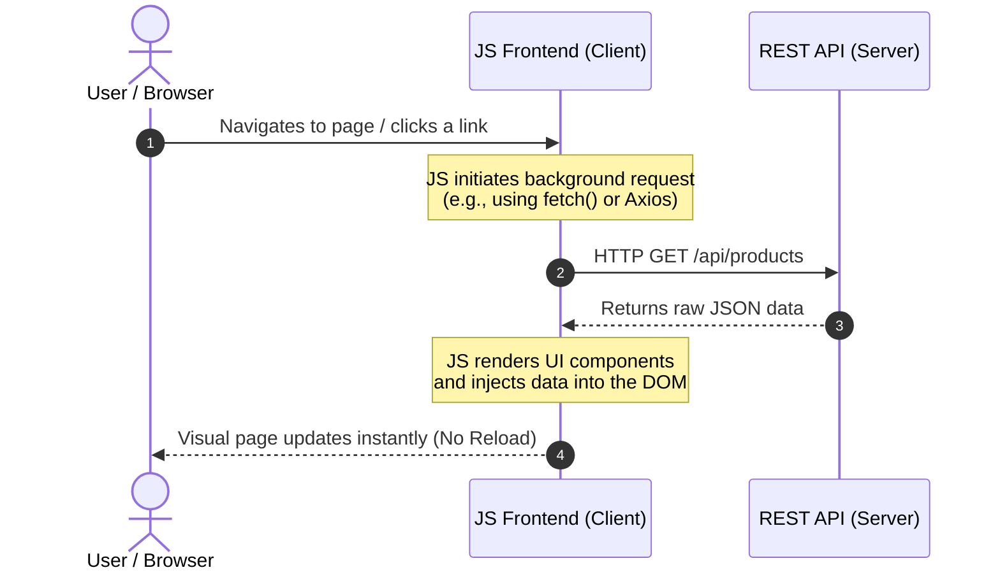
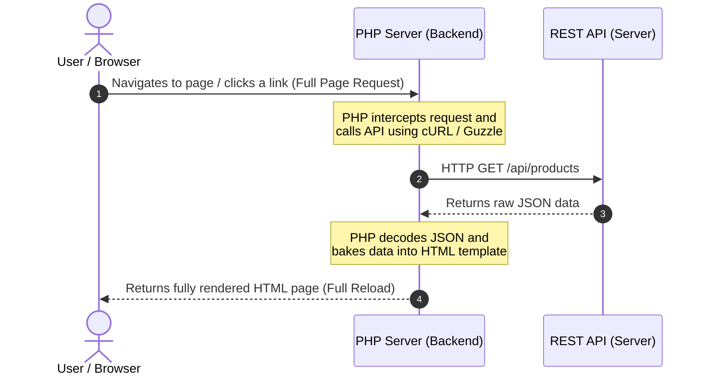

# How PHP web application differs from SPA Java Script application

The main difference lies in where the application logic runs and how the HTML is generated. A modern JavaScript Single-Page Application (SPA) 
shifts the rendering and user experience entirely to the user's web browser, while a traditional PHP application handles page generation 
on the web server before sending it over. 

* SPA Java Script app
  * Code runs in browser
  * Transfers raw data (JSON) over the network.
* PHP app
  * Code runs on backend
  * Transfers fully formatted HTML markup.

## SPA Java Script app flow 

## PHP application flow

# How to execute test

* Create podman network: `podman network create my-api-net`
* Run HTTP server: `MSYS_NO_PATHCONV=1 podman run -d --name my-php-server --network my-api-net -p 8000:8000 -v "$(pwd)":/usr/src/myapp -w /usr/src/myapp php:8.3-cli php -S 0.0.0.0:8000`
* Run test: `MSYS_NO_PATHCONV=1 podman run --rm --network my-api-net -v "$(pwd)":/usr/src/myapp -w /usr/src/myapp php:8.3-cli php test.php`