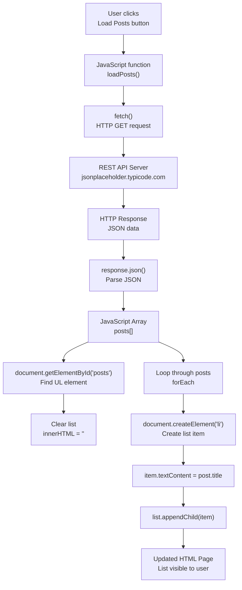

# Functionality flow diagram

```mermaid
flowchart TD
    A[User clicks<br/>Load Posts button] --> B["JavaScript function<br/>loadPosts()"]

    B --> C["fetch()<br/>HTTP GET request"]
    C --> D[REST API Server<br/>jsonplaceholder.typicode.com]

    D --> E[HTTP Response<br/>JSON data]
    E --> F["response.json()<br/>Parse JSON"]

    F --> G["JavaScript Array<br/>posts[]"]

    G --> H["document.getElementById('posts')<br/>Find UL element"]

    H --> I[Clear list<br/>innerHTML = '']

    G --> J[Loop through posts<br/>forEach]

    J --> K["document.createElement('li')<br/>Create list item"]
    K --> L[item.textContent = post.title]
    L --> M["list.appendChild(item)"]

    M --> N[Updated HTML Page<br/>List visible to user]
```